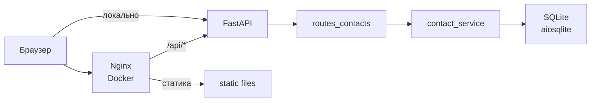

# Архитектура

## Слои

1. **Транспорт (FastAPI)** — `app/main.py`: маршрутизация, зависимости, глобальные обработчики исключений, опциональный mount статики, CORS.
2. **HTTP-слой контактов** — `app/api/routes_contacts.py`: эндпоинты под префиксом `/contacts` (итоговый путь `/api/contacts`, так как роутер подключён с `prefix="/api"`).
3. **Схемы** — `app/models/contact.py`: `ContactCreate`, `ContactUpdate`, `Contact` (ответ API).
4. **Сервис** — `app/services/contact_service.py`: запросы к БД, маппинг ORM → Pydantic.
5. **Доступ к данным** — `app/db.py`: async engine, `ContactORM`, фабрика сессий `get_db`.

## Жизненный цикл приложения

- При старте срабатывает **lifespan** в `main.py`: вызывается `init_db()`, который через `Base.metadata.create_all` создаёт таблицы при необходимости.
- Каждый запрос к API, использующий `Depends(get_db)`, получает **отдельную async-сессию** SQLAlchemy; после обработки запроса сессия закрывается контекстным менеджером.

## Модель данных (ORM)

Таблица `contacts` (`ContactORM`):

| Поле | Тип | Описание |
|------|-----|----------|
| `id` | INTEGER PK | Автоинкремент |
| `full_name` | VARCHAR(200) | Обязательное имя |
| `phone` | VARCHAR(200) | Телефон, по умолчанию пустая строка |
| `email` | VARCHAR(200) | Email |
| `notes` | TEXT | Заметки |
| `created_at` | DATETIME | Серверное время создания (`server_default=func.now()`) |

Сортировка списка в сервисе: **`ORDER BY id DESC`** (новые записи выше).

## Обработка ошибок

- **422** — ошибки валидации тела запроса: кастомный JSON с ключом `error` (`code: validation_error`, `message`, массив `details` с полями `field`, `message`, `code`). См. [api.md](api.md).
- **404** — контакт не найден (`detail` в стандартном формате FastAPI для `HTTPException`).
- **500** — необработанное исключение: унифицированный JSON `error.code = internal_error` без утечки внутренних деталей в ответе.

## Статика и API на одном процессе

Если переменная окружения **`SERVE_STATIC`** не равна `"0"`, монтируется каталог `static/` в корень сайта (`StaticFiles(..., html=True)`). Тогда корень `/` отдаёт `index.html`, а API остаётся под `/api/...`.

**Важно:** порядок регистрации в `main.py` — сначала `include_router`, затем `mount("/", ...)`. FastAPI сопоставляет более специфичные пути раньше, поэтому `/api/contacts` обрабатывается роутером, а не статикой.
